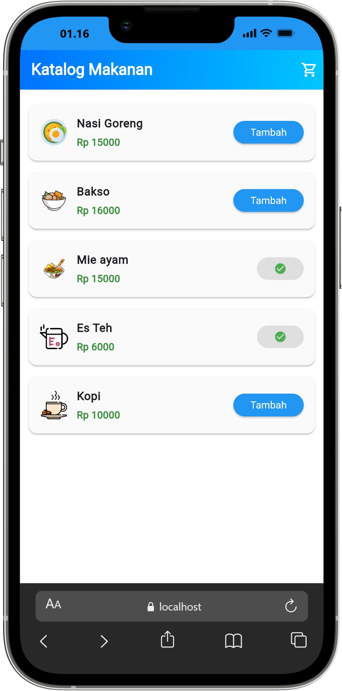
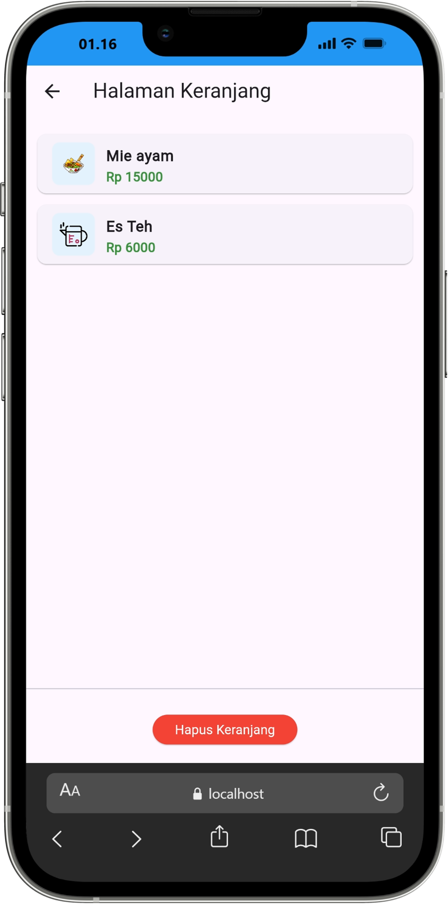

# Flutter State Management - Provider & Clean Architecture

Aplikasi Katalog Makanan interaktif yang dibangun menggunakan **Flutter**. Aplikasi ini mengimplementasikan pola **Clean Architecture** untuk pemisahan kode yang rapi dan menggunakan **Provider** sebagai *State Management* terpusat. 

Project ini dikembangkan untuk memenuhi tugas mata kuliah **Aplikasi Mobile Lanjutan.**

## ✨ Fitur Utama
* **Katalog Produk Dinamis**: Menampilkan daftar makanan (Nasi Goreng, Bakso, Mie Ayam, dll) beserta harga dan custom gambar *assets* untuk masing-masing item.
* **State Management Provider**: 
    * Menggunakan `ChangeNotifierProvider` untuk inisialisasi state.
    * Menggunakan `context.select` untuk optimasi *rebuild* pada tombol tambah (hanya *rebuild* jika status item spesifik berubah).
    * Menggunakan `context.watch` pada halaman keranjang agar UI otomatis ter-update secara *real-time*.
* **Custom UI/UX**: Tampilan telah ditingkatkan menggunakan `Card`, kustomisasi *icon launcher*, dan efek gradasi linear biru pada `AppBar` agar lebih modern.
* **Keranjang Belanja**: Fitur penambahan item ke keranjang dan tombol untuk menghapus seluruh isi keranjang sekaligus.

## 📸 Preview

  
  

## 🏗️ Arsitektur Aplikasi (Clean Architecture)
Kode dalam project ini dipisahkan berdasarkan tanggung jawabnya untuk menjaga skalabilitas dan kemudahan pengujian:

    lib/
    ├── core/               # Konfigurasi global dan routing aplikasi (AppRouter)
    ├── features/cart/
    │   ├── data/           # Implementasi repository (CartRepositoryImpl)
    │   ├── domain/         # Aturan bisnis murni (Product Entity & CartRepository interface)
    │   └── presentation/   # UI layer (Pages, Widgets, dan CartProvider)
    ├── injection.dart      # Setup Dependency Injection
    └── main.dart           # Entry point aplikasi

## 🚀 Cara Menjalankan Project
1. Pastikan Anda telah menginstal Flutter SDK.
2. Clone repositori ini: `git clone <URL_REPO_GITHUB_ANDA>`
3. Masuk ke direktori project: `cd <NAMA_FOLDER_PROJECT>`
4. Unduh semua *dependencies*: `flutter pub get`
5. Jalankan aplikasi di emulator atau perangkat fisik: `flutter run`

## 👨‍💻 Pengembang
* **NIM**: 1123150070
* **Nama**: Satria Herlambang
* **Prodi**: Teknik Informatika
* **Dosen Pengampu**: IKetut Gunawan, S.KOM, M.T.I